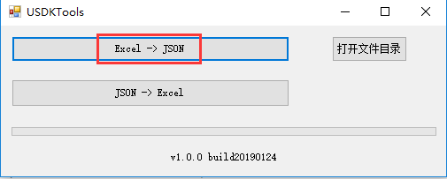
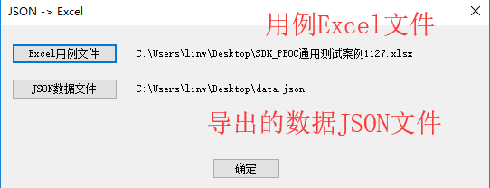
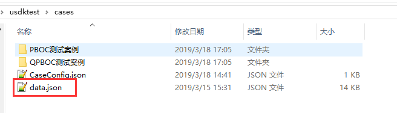
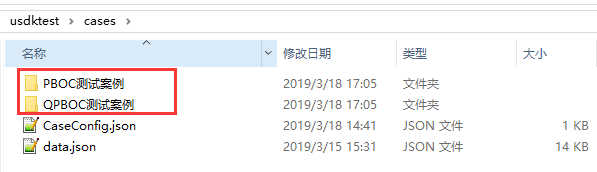
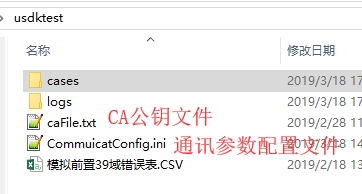
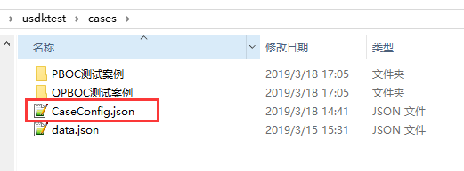

# 使用说明

## 测试前准备

- 使用导入导出工具将用例 Excel 文件导出成 `data.json` 文件
  
  

- 使用 `data.json` 文件替换 `usdktest` 文件夹下的同名文件  
  

- 将用例文件放到 `usdktest` 下的 `cases` 文件夹下  
  

- （可选）若需要修改通讯配置参数，请直接修改以下对应的配置文件即可  
  

- （可选）修改用例配置文件（用于调试时过滤用例用）  
     
  配置选项说明：

  ```json
  {
  	"cases": [
  		// 1. 筛选具体案例（与2不能共存）
  		{
  			"caseSet": "PBOC测试案例", // 测试集名称
  			"cases": ["case-001"] // 该测试集下需要调试的用例名称
  		}
  	],
  	"caseSets": ["PBOC测试案例"] // 2. 筛选测试集下的所有案例，与1不能共存
  }
  ```

- 将整个 `usdktest` 文件夹放到 SD **卡根目录**下

## 测试

- 将 POS 使用 USB 连接到 PC
- 双击 `adb_forward.bat` 来将本地端口映射到 adb 端口
- 打开浏览器，输入 `localhost:8081`
- 点击 `测试` 标签打开测试页面
- （可选）点击
