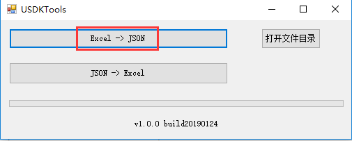
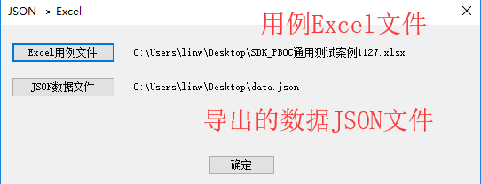
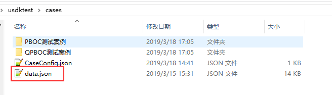
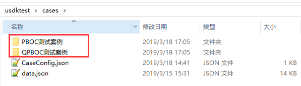
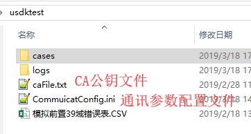
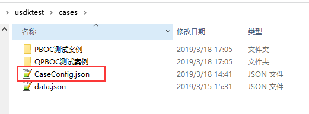
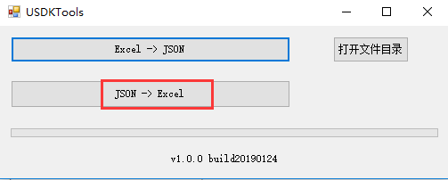
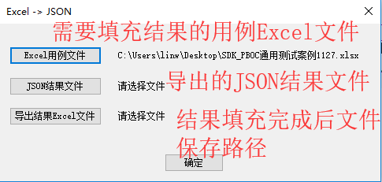

# 使用说明

## 测试前准备

- 使用导入导出工具将用例 Excel 文件导出成 `data.json` 文件  
    
  

- 使用 `data.json` 文件替换 `usdktest` 文件夹下的同名文件  
  

- 将用例文件放到 `usdktest` 下的 `cases` 文件夹下  
  

- （可选）若需要修改通讯配置参数，请直接修改以下对应的配置文件即可  
  

- （可选）修改用例配置文件（用于调试时过滤用例用）  
     
  配置选项说明：

  ```json
  {
  	"cases": [
  		// 1. 筛选具体案例（与2不能共存）
  		{
  			"caseSet": "PBOC测试案例", // 测试集名称
  			"cases": ["case-001"] // 该测试集下需要调试的用例名称
  		}
  	],
  	"caseSets": ["PBOC测试案例"] // 2. 筛选测试集下的所有案例，与1不能共存
  }
  ```

- 将整个 `usdktest` 文件夹放到 SD **卡根目录**下

## 测试

- 将 POS 使用 USB 连接到 PC
- 双击 `adb_forward.bat` 来将本地端口映射到 adb 端口
- 打开浏览器，输入 `localhost:8081`
- 点击 `测试` 标签打开测试页面
- （可选）点击 `测试` > `初始化用例数据库` 来将用例数据导入 POS 端数据库中，**首次测试或者测试用例数据发生变化的时候，需要使用该功能导入用例到数据库中**，导入成功后用例列表中会显示所有用例及其摘要信息
- （可选）通过筛选案例功能筛选案例

  - `用例集` --- 用来过滤特定用例集下的数据
  - `用例名称` --- 用来按名称筛选案例，支持使用逗号来同时筛选多个案例
  - `全部用例` --- 筛选全部案例
  - `失败用例` --- 筛选失败的案例
  - `成功用例` --- 筛选成功的案例
  - `排队用例` --- 筛选等待执行的案例

- 执行测试
  - `全部执行` --- 执行全部案例
  - `执行当前案例` --- 执行案例列表中选中的当前案例
  - `执行筛选案例` --- 执行有筛选用例功能筛选出的案例
- 查看测试进度

  - `执行进度` --- 用例执行进度，以百分比显示
  - `用例状态` --- 对用例执行状态的统计，可以显示
    - `成功案例数`
    - `失败案例数`
    - `排队中案例数`
    - `正在执行案例数`

- （可选）选中用例列表中的案例后可以查看用例详细信息，包括

  - `用例描述`
  - `测试结果`

- （可选）点击 `查看日志` 按钮可以查看当前选中案例的日志文件，**失败的案例才会保存**

- （可选）点击 `查看实际结果` 按钮可以直接以文本方式查看用例的完整执行结果

- 测试完成后，点击 `导出测试数据` 按钮来导出测试数据，数据文件会被保存的到浏览器的默认下载路径，名称为 `data.json`

- 通过用例导入导出工具来自动填写测试结果到用例 Excel 文件中  
    
  

## 文件编辑功能

该功能主要有以下应用场景

- 调试案例时，需要修改用例文件，避免通过在 PC 端修改用例文件后推送到 POS 的步骤，提高调试效率
- 方便快速查看 POS 端的文件内容
